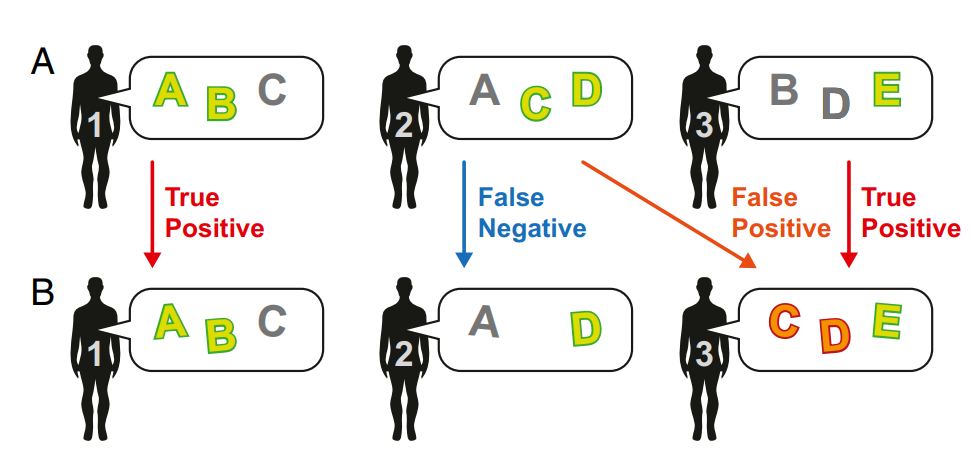

TODOs:
- [] Write Readme.md

Feature ideas:
* merge multiple download and metadata files

* Report Ideas:
Check if lower cutoff improves the results

## Introduction
The paper ["Identifying personal microbiomes using metagenomic codes"](https://www.pnas.org/doi/10.1073/pnas.1423854112) by Franzosa et al. shows that using hitting sets based on
metagenomic codes can be used to match samples to subjects. A hitting set is a set of metagenomic features which can uniquely
identify a subject, in the paper also refered ti as metagenomic codes. 

### Evaluation
The original paper uses a confusion matrix where the classes can be identified as follows:
- **True Positive (TP)**: A samples was correctly matched, meaning two different visits were matched to the same person.
- **False Negative**: A previous extracted code does not match the same sample anymore.
- **False Positive**: One code matches multiple samples. All samples that are not the original sample are false positives.

Some public datasets provide different sample lists that only partly overlap including a new class:
- **True Negative**: A sample that does not have a match because it was not included in the initial dataset that was used
to create the codes.

 Source: "Identifying personal microbiomes using metagenomic codes" by Franzosa et al.